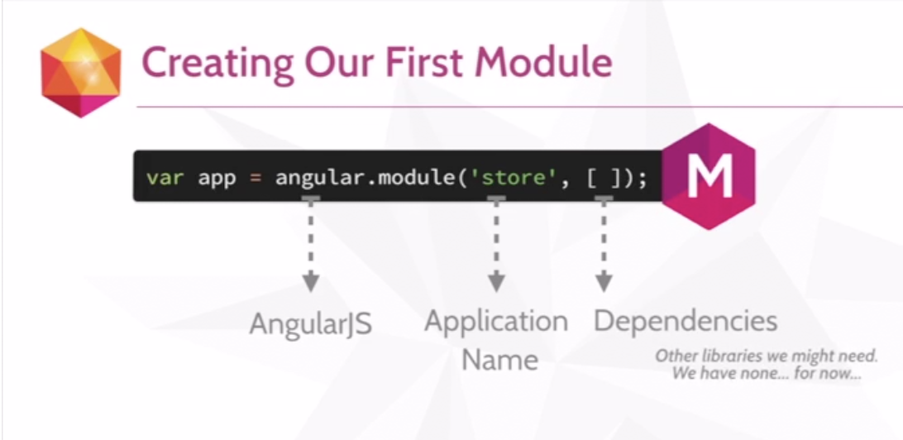
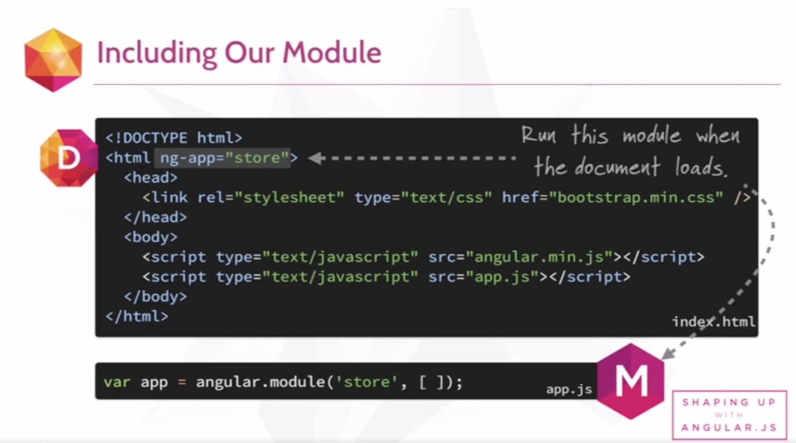
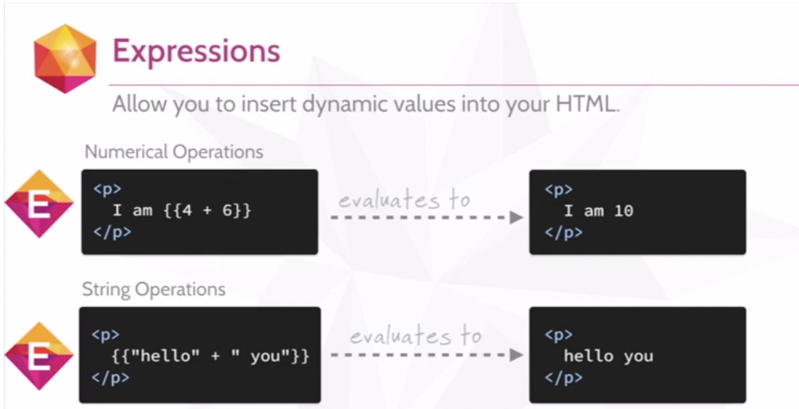
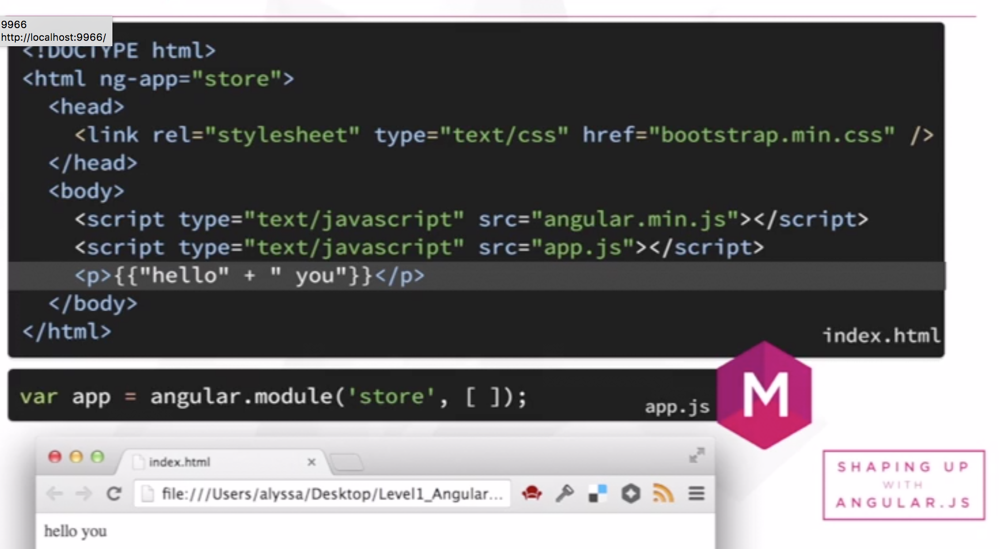

# Learn Angular.JS

## Directives
  - Links the behaviour to the HTML
  - `ng-controller`

## Modules
  - Encapsulates our JS
  - Define dependencies for our app
  - Module lines
  
  

## Expressions
  - Allow you to insert dynamic values into HTML
  
  
